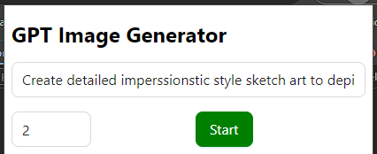
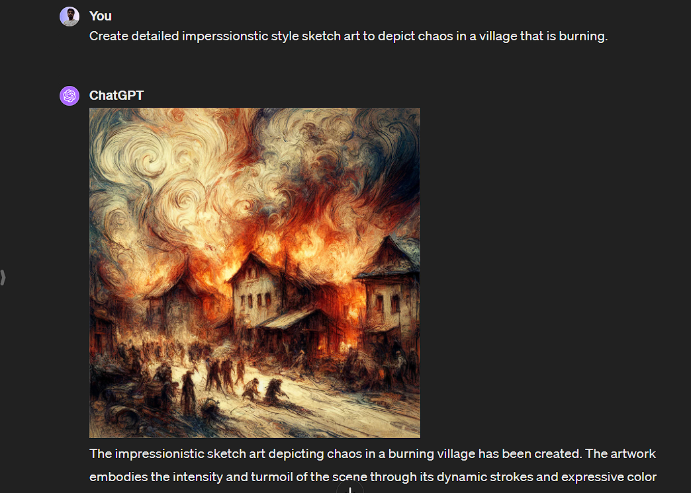

# DallE Image Generator Extension

**Description:** Idea behind making this `chrome extension` was to automate image generation process. If you've `ChatGPT Plus` account and you tried generating
images through their service called `DALL-E` then you might have seen that you don't get exact thing you want in first cut... For that, you have to make few attempts or you have to enter prompt again and again so that you can pick `1` out of `10` generation...

And waiting and entering prompt again and again is kind a tedious process and you might get irritated doing so.

### How this Extension can help you?

So, it basically takes 3 paramerters or input as of now. where you defined things like:

- Initial Prompt to start with
- Total no. of iteration it should do
- Start process button to execute script

### How to use this extension

1. Click on extension and open popup and fill these value.

2. Click on `Start` button and refresh `page`.
3. And then it will start generating image like this, first time it enters prompt given by you... And then use next, next after that...

4. Yah that's it, go and have fun now... or do other things as you please... You can checkout it later once your generations are ready 😃